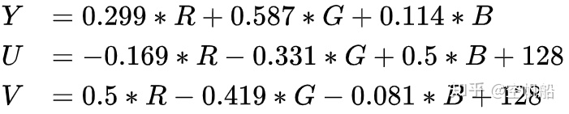

YUV格式是一种视频压缩编码格式，相比一般的RGB编码可以节省很多空间。  
现代图像视频压缩技术都在研究人脑，如果发现人脑对某些信息不敏感，则表示那部分信息存在较大的压缩空间。YUV格式就利用了人眼对亮度敏感，对色度不敏感的特性进行处理。    
一般的视频采集芯片输出的码流一般都是 YUV 格式数据流，后续视频处理也是对 YUV 数据流进行编码和解析。所以，了解 YUV 数据流对做视频领域的人而言，至关重要。

在介绍 YUV 格式之前，首先介绍一下我们熟悉的 RGB 格式。

# RGB
RGB 分别表示红（R）、绿（G）、蓝（B），也就是三原色，将它们以不同的比例叠加，可以产生不同的颜色。

比如一张 1920 * 1280 的图片，代表着有 1920 * 1280 个像素点。如果采用 RGB 编码方式，每个像素点都有红、绿、蓝三个原色，其中每个原色占用 8 个字节，每个像素占用 24 个字节。

那么，一张 1920 * 1280 大小的图片，就占用 1920 * 1280 * 3 / 1024 / 1024 = 7.03MB 存储空间。

# YUV
YUV 编码采用了明亮度和色度表示每个像素的颜色。
* Y Luminance，明亮度，也就是灰度值
* U Chrominance 色度，色调
* V Chroma 浓度，饱和度

YUV格式也被称为YCbCr格式。 YCbCr 其实是 YUV 经过缩放和偏移的翻版。其中 Y 与 YUV 中的 Y 含义一致,Cb,Cr 同样都指色彩，只是在表示方法上不同而已。YCbCr 其中 Y 是指亮度分量，Cb 指蓝色色度分量，而 Cr 指红色色度分量。

YUV格式是如何产生的？最初是为了解决彩色电视机与黑白电视机兼容问题。后来发现人眼对亮度敏感、对色度不敏感的特性，YUV在数据压缩方面也起到重要作用。  

# YUV和RGB之间的转换
因为Y表示灰度，所以Y其实就表示彩色转黑白。


# YUV优点
对于 YUV 所表示的图像，Y 和 UV 分量是分离的。如果只有 Y 分量而没有 UV 分离，那么图像表示的就是黑白图像。彩色电视机采用的就是 YUV 图像，解决与和黑白电视机的兼容问题，使黑白电视机也能接受彩色电视信号。

人眼对色度的敏感程度低于对亮度的敏感程度。主要原因是视网膜杆细胞多于视网膜锥细胞，其中视网膜杆细胞的作用就是识别亮度，视网膜锥细胞的作用就是识别色度。所以，眼睛对于亮度的分辨要比对颜色的分辨精细一些。

利用这个原理，可以把色度信息减少一点，人眼也无法查觉这一点。

所以，并不是每个像素点都需要包含了 Y、U、V 三个分量，根据不同的采样格式，可以每个 Y 分量都对应自己的 UV 分量，也可以几个 Y 分量共用 UV 分量。相比 RGB，能够节约不少存储空间。

# YUV采样格式
YUV主流采样格式有如下三种：
* YUV 4:4:4采样
* YUV 4:2:2采样
* YUV 4:2:0采样

YUV 4:4:4表示YUV三分量采样率相同，每个像素三分量信息完整，都是8bit，每个点用三个字节表示。这种格式与RGB格式可以完全无损转换。  

YUV 4:2:2采样，对U、V分量进行二分之一采样。这个改动使得数据量变为原来的三分之二。  
```
四个像素为： [Y0 U0 V0] [Y1 U1 V1] [Y2 U2 V2] [Y3 U3 V3]
采样的码流为： Y0 U0 Y1 V1 Y2 U2 Y3 U3
映射出的像素点为：[Y0 U0 V1]、[Y1 U0 V1]、[Y2 U2 V3]、[Y3 U2 V3]
```

YUV 4:2:0，YUV 4:2:0 并不意味着不采样 V 分量。它指的是对每条扫描线来说，只有一种色度分量以 2:1 的采样率存储，相邻的扫描行存储不同的色度分量。也就是说，如果第一行是 4:2:0，下一行就是 4:0:2，在下一行就是 4:2:0，以此类推。

```
图像像素为：
[Y0 U0 V0]、[Y1 U1 V1]、 [Y2 U2 V2]、 [Y3 U3 V3]
[Y5 U5 V5]、[Y6 U6 V6]、 [Y7 U7 V7] 、[Y8 U8 V8]
采样的码流为：
Y0 U0 Y1 Y2 U2 Y3 
Y5 V5 Y6 Y7 V7 Y8
映射出的像素点为：
[Y0 U0 V5]、[Y1 U0 V5]、[Y2 U2 V7]、[Y3 U2 V7]
[Y5 U0 V5]、[Y6 U0 V5]、[Y7 U2 V7]、[Y8 U2 V7]
```
YUV 4:2:0相比YUV4:4:4数据量省了一半。  


# YUV存储格式
YUV有两种存储格式：
* 平面格式（Planar format）：先连续存储所有像素点的 Y，紧接着存储所有像素点的 U，随后是所有像素点的 V。
* 打包格式（Packed format）：每个像素点的 Y、U、V 是连续交错存储的。

YUV格式按照`采样方式*存储格式`可以产生多种YUV存储格式。
* YUYV
* UYVY
* YUV422P
* YUV420P和YUV420SP
* YU12和YU21
* NV12和NV21


# YUV图像处理
YUV格式进行图像处理的时候，并不需要对数据进行太多转换，直接操作YUV格式也是能够做到的，因为YUV这种压缩格式是非常便于计算机处理的。  
## YUV图像的加载
```cpp
//YUV420SP  NV21 or NV12 

typedef struct
{
    int width;                 // 图片宽
    int height;                // 图片高 
    unsigned char  *yPlane;    // Y 平面指针
    unsigned char  *uvPlane;   // UV 平面指针
} YUVImage;

void LoadYUVImage(const char *filePath, YUVImage *pImage)
{
    FILE *fpData = fopen(filePath, "rb+");
    if (fpData != NULL)
    {
        fseek(fpData, 0, SEEK_END);
        int len = ftell(fpData);
        pImage->yPlane = malloc(len);
        fseek(fpData, 0, SEEK_SET);
        fread(pImage->yPlane, 1, len, fpData);
        fclose(fpData);
        fpData = NULL;
    }
    pImage->uvPlane = pImage->yPlane + pImage->width * pImage->height;
}

void SaveYUVImage(const char *filePath, YUVImage *pImage)
{
    FILE *fp = fopen(filePath, "wb+");
    if (fp)
    {
        fwrite(pImage->yPlane, pImage->width * pImage->height, 1, fp);
        fwrite(pImage->uvPlane, pImage->width * (pImage->height >> 1), 1, fp);
    }
}

void ReleaseYUVImage(YUVImage *pImage)
{
    if (pImage->yPlane)
    {
        free(pImage->yPlane);
        pImage->yPlane = NULL;
        pImage->uvPlane = NULL;
    }
}

```
## NV21图片旋转
其实就是将Y面和UV面分别旋转90度。
```cpp
//angle 90,  270, 180
void RotateYUVImage(YUVImage *pSrcImg, YUVImage *pDstImg, int angle)
{
    int yIndex = 0;
    int uvIndex = 0;
    switch (angle)
    {
    case 90:
    {
        // y plane
        for (int i = 0; i < pSrcImg->width; i++) {
            for (int j = 0; j < pSrcImg->height; j++) {
                *(pDstImg->yPlane + yIndex) = *(pSrcImg->yPlane + (pSrcImg->height - j - 1) * pSrcImg->width + i);
                yIndex++;
            }
        }

        //uv plane
        for (int i = 0; i < pSrcImg->width; i += 2) {
            for (int j = 0; j < pSrcImg->height / 2; j++) {
                *(pDstImg->uvPlane + uvIndex) = *(pSrcImg->uvPlane + (pSrcImg->height / 2 - j - 1) * pSrcImg->width + i);
                *(pDstImg->uvPlane + uvIndex + 1) = *(pSrcImg->uvPlane + (pSrcImg->height / 2 - j - 1) * pSrcImg->width + i + 1);
                uvIndex += 2;
            }
        }
    }
    break;
    case 180:
    {
        // y plane
        for (int i = 0; i < pSrcImg->height; i++) {
            for (int j = 0; j < pSrcImg->width; j++) {
                *(pDstImg->yPlane + yIndex) = *(pSrcImg->yPlane + (pSrcImg->height - 1 - i) * pSrcImg->width + pSrcImg->width - 1 - j);
                yIndex++;
            }
        }

        //uv plane
        for (int i = 0; i < pSrcImg->height / 2; i++) {
            for (int j = 0; j < pSrcImg->width; j += 2) {
                *(pDstImg->uvPlane + uvIndex) = *(pSrcImg->uvPlane + (pSrcImg->height / 2 - 1 - i) * pSrcImg->width + pSrcImg->width - 2 - j);
                *(pDstImg->uvPlane + uvIndex + 1) = *(pSrcImg->uvPlane + (pSrcImg->height / 2 - 1 - i) * pSrcImg->width + pSrcImg->width - 1 - j);
                uvIndex += 2;
            }
        }
    }
    break;
    case 270:
    {
        // y plane
        for (int i = 0; i < pSrcImg->width; i++) {
            for (int j = 0; j < pSrcImg->height; j++) {
                *(pDstImg->yPlane + yIndex) = *(pSrcImg->yPlane + j * pSrcImg->width + (pSrcImg->width - i - 1));
                yIndex++;
            }
        }

        //uv plane
        for (int i = 0; i < pSrcImg->width; i += 2) {
            for (int j = 0; j < pSrcImg->height / 2; j++) {
                *(pDstImg->uvPlane + uvIndex + 1) = *(pSrcImg->uvPlane + j * pSrcImg->width + (pSrcImg->width - i - 1));
                *(pDstImg->uvPlane + uvIndex) = *(pSrcImg->uvPlane + j * pSrcImg->width + (pSrcImg->width - i - 2));
                uvIndex += 2;
            }
        }
    }
    break;
    default:
        break;
    }

}
```
## 图像缩放
```cpp
void ResizeYUVImage(YUVImage *pSrcImg, YUVImage *pDstImg)
{
    if (pSrcImg->width > pDstImg->width)
    {
        //缩小
        int x_scale = pSrcImg->width / pDstImg->width;
        int y_scale = pSrcImg->height / pDstImg->height;

        for (size_t i = 0; i < pDstImg->height; i++)
        {
            for (size_t j = 0; j < pDstImg->width; j++)
            {
                *(pDstImg->yPlane + i*pDstImg->width + j) = *(pSrcImg->yPlane + i * y_scale *pSrcImg->width + j * x_scale);
            }
        }

        for (size_t i = 0; i < pDstImg->height / 2; i++)
        {
            for (size_t j = 0; j < pDstImg->width; j += 2)
            {
                *(pDstImg->uvPlane + i*pDstImg->width + j) = *(pSrcImg->uvPlane + i * y_scale *pSrcImg->width + j * x_scale);
                *(pDstImg->uvPlane + i*pDstImg->width + j + 1) = *(pSrcImg->uvPlane + i * y_scale *pSrcImg->width + j * x_scale + 1);
            }
        }
    }
    else
    {
        // 放大
        int x_scale = pDstImg->width / pSrcImg->width;
        int y_scale = pDstImg->height / pSrcImg->height;

        for (size_t i = 0; i < pSrcImg->height; i++)
        {
            for (size_t j = 0; j < pSrcImg->width; j++)
            {
                int yValue = *(pSrcImg->yPlane + i *pSrcImg->width + j);
                for (size_t k = 0; k < x_scale; k++)
                {
                    *(pDstImg->yPlane + i * y_scale * pDstImg->width + j  * x_scale + k) = yValue;
                }
            }

            unsigned char  *pSrcRow = pDstImg->yPlane + i * y_scale * pDstImg->width;
            unsigned char  *pDstRow = NULL;
            for (size_t l = 1; l < y_scale; l++)
            {
                pDstRow = (pDstImg->yPlane + (i * y_scale + l)* pDstImg->width);
                memcpy(pDstRow, pSrcRow, pDstImg->width * sizeof(unsigned char ));
            }
        }

        for (size_t i = 0; i < pSrcImg->height / 2; i++)
        {
            for (size_t j = 0; j < pSrcImg->width; j += 2)
            {
                int vValue = *(pSrcImg->uvPlane + i *pSrcImg->width + j);
                int uValue = *(pSrcImg->uvPlane + i *pSrcImg->width + j + 1);
                for (size_t k = 0; k < x_scale * 2; k += 2)
                {
                    *(pDstImg->uvPlane + i * y_scale * pDstImg->width + j  * x_scale + k) = vValue;
                    *(pDstImg->uvPlane + i * y_scale * pDstImg->width + j  * x_scale + k + 1) = uValue;
                }
            }

            unsigned char  *pSrcRow = pDstImg->uvPlane + i * y_scale * pDstImg->width;
            unsigned char  *pDstRow = NULL;
            for (size_t l = 1; l < y_scale; l++)
            {
                pDstRow = (pDstImg->uvPlane + (i * y_scale + l)* pDstImg->width);
                memcpy(pDstRow, pSrcRow, pDstImg->width * sizeof(unsigned char ));
            }
        }
    }
}
```
## 图片裁剪
```cpp
// x_offSet ，y_offSet % 2 == 0
void CropYUVImage(YUVImage *pSrcImg, int x_offSet, int y_offSet, YUVImage *pDstImg)
{
    // 确保裁剪区域不存在内存越界
    int cropWidth = pSrcImg->width - x_offSet;
    cropWidth = cropWidth > pDstImg->width ? pDstImg->width : cropWidth;
    int cropHeight = pSrcImg->height - y_offSet;
    cropHeight = cropHeight > pDstImg->height ? pDstImg->height : cropHeight;
    
    unsigned char  *pSrcCursor = NULL;
    unsigned char  *pDstCursor = NULL;

    //crop yPlane
    for (size_t i = 0; i < cropHeight; i++)
    {
        pSrcCursor = pSrcImg->yPlane + (y_offSet + i) * pSrcImg->width + x_offSet;
        pDstCursor = pDstImg->yPlane + i * pDstImg->width;
        memcpy(pDstCursor, pSrcCursor, sizeof(unsigned char ) * cropWidth);
    }

    //crop uvPlane
    for (size_t i = 0; i < cropHeight / 2; i++)
    {
        pSrcCursor = pSrcImg->uvPlane + (y_offSet / 2 + i) * pSrcImg->width + x_offSet;
        pDstCursor = pDstImg->uvPlane + i * pDstImg->width;
        memcpy(pDstCursor, pSrcCursor, sizeof(unsigned char ) * cropWidth);
    }

}
```
## 一个综合示例
```cpp
void main()
{
    YUVImage srcImg = { 0 };
    srcImg.width = 840;
    srcImg.height = 1074;
    LoadYUVImage("IMG_840x1074.NV21", &srcImg);

    YUVImage rotateDstImg = { 0 };
    rotateDstImg.width = 1074;
    rotateDstImg.height = 840;
    rotateDstImg.yPlane = malloc(rotateDstImg.width * rotateDstImg.height*1.5);
    rotateDstImg.uvPlane = rotateDstImg.yPlane + rotateDstImg.width * rotateDstImg.height;

    RotateYUVImage(&srcImg, &rotateDstImg, 270);

    SaveYUVImage("D:\\material\\IMG_1074x840_270.NV21", &rotateDstImg);

    RotateYUVImage(&srcImg, &rotateDstImg, 90);

    SaveYUVImage("D:\\material\\IMG_1074x840_90.NV21", &rotateDstImg);

    rotateDstImg.width = 840;
    rotateDstImg.height = 1074;
    RotateYUVImage(&srcImg, &rotateDstImg, 180);

    SaveYUVImage("D:\\material\\IMG_840x1074_180.NV21", &rotateDstImg);


    YUVImage resizeDstImg = { 0 };
    resizeDstImg.width = 420;
    resizeDstImg.height = 536;
    resizeDstImg.yPlane = malloc(resizeDstImg.width * resizeDstImg.height*1.5);
    resizeDstImg.uvPlane = resizeDstImg.yPlane + resizeDstImg.width * resizeDstImg.height;

    ResizeYUVImage(&srcImg, &resizeDstImg);

    SaveYUVImage("D:\\material\\IMG_420x536_Resize.NV21", &resizeDstImg);

    YUVImage cropDstImg = { 0 };
    cropDstImg.width = 300;
    cropDstImg.height = 300;
    cropDstImg.yPlane = malloc(cropDstImg.width * cropDstImg.height*1.5);
    cropDstImg.uvPlane = cropDstImg.yPlane + cropDstImg.width * cropDstImg.height;

    CropYUVImage(&srcImg, 100, 500, &cropDstImg);

    SaveYUVImage("D:\\material\\IMG_300x300_crop.NV21", &cropDstImg);

    ReleaseYUVImage(&srcImg);
    ReleaseYUVImage(&rotateDstImg);
    ReleaseYUVImage(&resizeDstImg);
    ReleaseYUVImage(&cropDstImg);
}
```

# 参考资料
YUV：维基百科：https://zh.wikipedia.org/zh-sg/YUV
https://zhuanlan.zhihu.com/p/75735751
雷霄骅：北邮大神，https://blog.csdn.net/leixiaohua1020/article/details/50534150